**Introduction** :

I have created a backend project that boasts CRUD (Create, Read, Update, Delete) operations for forms. Whether you're collecting user responses, survey data, or any form-based information, the backend will handle it.

Plug and Play Customization: Any business or organisation can effortlessly plug in additional functionality tailored to their specific needs. There is no need to worry about interfering with existing systems or disrupting established business logic for other organisations.

**Database Design Specification** :

I have used a relational database model, creating 4 different tables for forms, questions, answers and responses:

1. **Forms Table :**

form\_id (Primary Key) title

metadata

2. **Questions Table :**

question\_id (Primary Key)

form\_id (Foreign Key referencing Forms table) text (question text)

text type (e.g., multiple-choice, text, number etc.) metadata

3. **Responses Table :**

response\_id (Primary Key)

form\_id (Foreign Key referencing Forms table) user\_id (if capturing responses from specific users)

submitted\_at (timestamp) metadata

4. **Answers Table :**

answer\_id (Primary Key)

response\_id (Foreign Key referencing Responses table) question\_id (Foreign Key referencing Questions table) text (answer text)

metadata

**Relationship between tables** :

- One *form* can have many *questions*.
- One *question* belongs to one *form*.
- One *response* belongs to one *form*.
- One *response* can have many *answers*.
- One *answer* belongs to one *response* and one *question*.

**ER Diagram** :

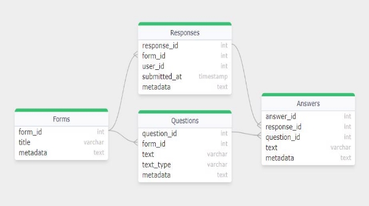

**Key Relationships :**

**Problem with other approaches for DB design** :

1. Single table -> Forms Table having formID, questions, responses.
1. Two tables -> Forms and Response:
- Forms:

form\_id (Primary Key)

title

questions (array)

metadata

- Responses:

response\_id (Primary Key)

form\_id (Foreign Key referencing Forms table)

answers (array to corrosponding questions)

Problem with above two db designs is that lets say if we consider the use-case of slang statement given in assessment, we would have our data stored in our database and at the backend in our business logic, we would need answers to all the responses to that particular question “What is city?" But in the above two designs, we won't be able to get all the answers to that particular question because we don't have any question IDs assigned to particular questions of a particular form. So these designs won’t work. Similarly these designs won’t work for some other use cases.

**Architecture** :

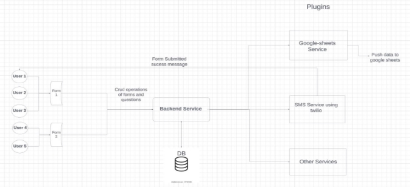

**Improved Architecture** :

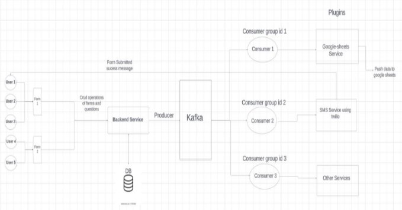

**Overview:**

This project consists of a primary backend service serving as the core application, and additional plug-and-play services, like Google Sheets and Twilio SMS, can be seamlessly added to extend functionality for diverse use cases.

**Backend Service** :

The main service serves as the central component, handling requests, executing logic, and connecting with databases. It adheres to the MVC pattern, utilising express.js for APIs.

**Kafka Server** :

Integrating Kafka provides scalable and fault-tolerant event-driven architecture, enabling real-time data streaming and seamless communication between microservices. Its robust message queuing system ensures reliable data processing and enhances overall system resilience.

**Plug and Play Services** :

Plug-and-play services seamlessly integrate with the architecture, developed and maintained independently. They enhance app capabilities as required

**Benefits of the Architecture** :

Scalability: Independent service scaling. Modularity: Focused services for maintainability. Flexibility: Extensible via plug-and-play services.

**For example : Google-sheet Integration** :

One service integrates the Google Sheets API. It acquires and writes data to a Google Sheet.

Reference to google-sheet api docs : [Node.js quickstart | Gmail | Google for Developers](https://developers.google.com/gmail/api/quickstart/nodejs)

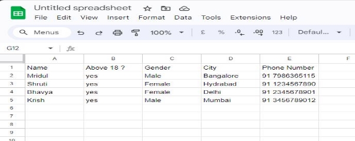

**Another Example : Twilio SMS Integration** :

Another service integrates the Twilio SMS API. It sends SMS notifications, enhancing communication.

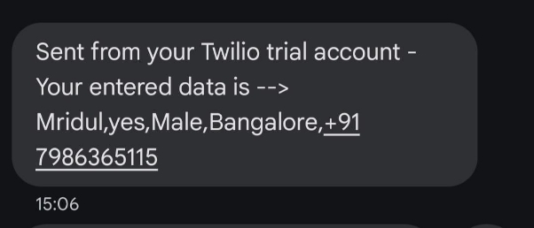

**API Endpoints created** :

1. POST: /createForm (body: title of form , array of questions) → returns formId in response

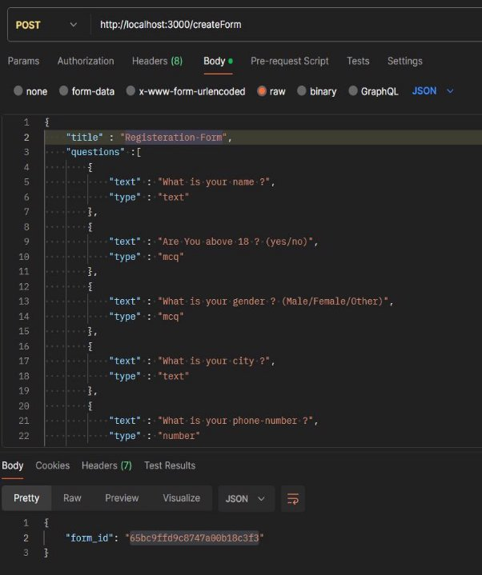

2. GET: /getQuestions (param: formId) → returns all questions text and questionId in response

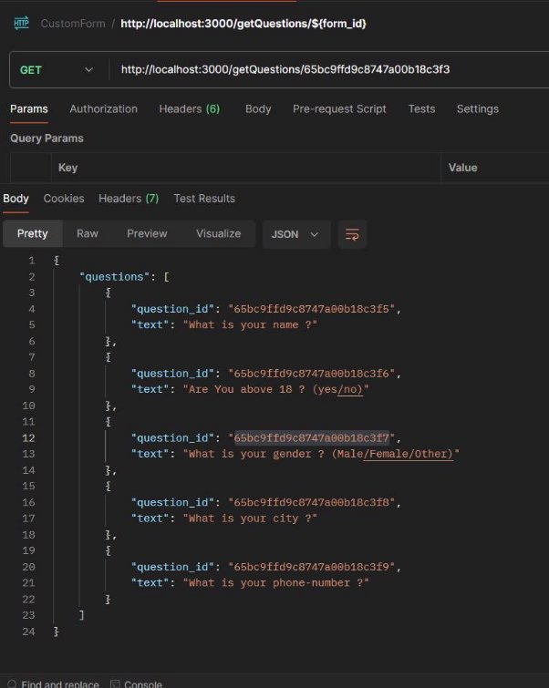

3. POST: /createResponse (body: formId, array of answers, userId) → returns responseId in response

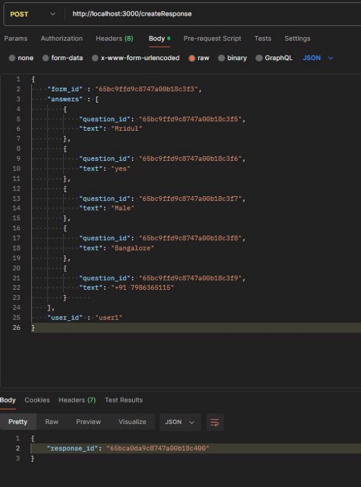

4. GET: /getAnswerForResponse (param: responseId) → returns an answer array for that response

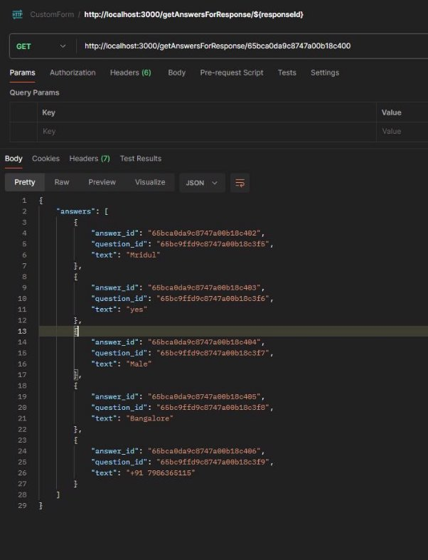

5. GET: /getAnswer (param: questionId, responseId) → returns answerId and answer

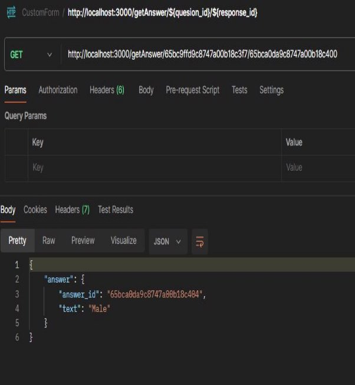

6. GET: /getAllResponse (param: formId) → returns array of {responseId, array of answers}

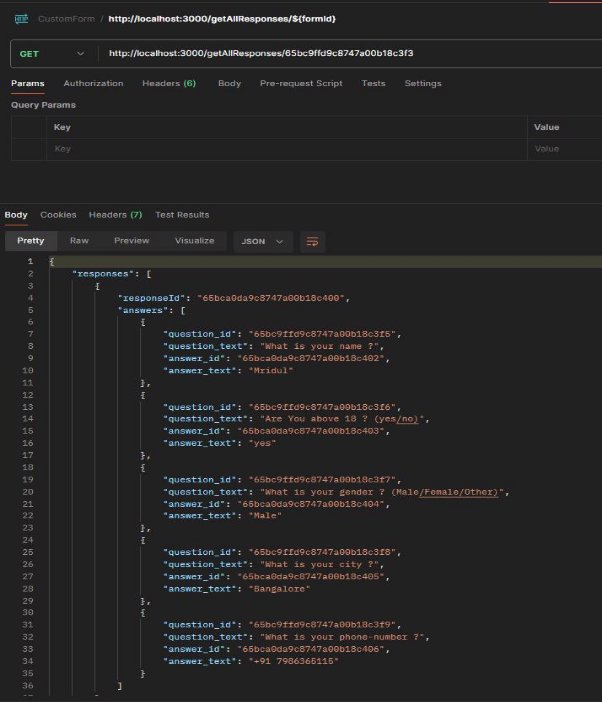

7. PATCH: /updateAnswer (params: questionId, responseId) , body(newAnswer) → returns answer obj

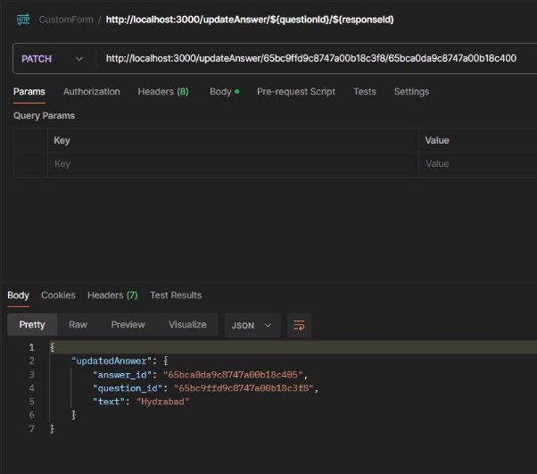

**Mongo DB Tables Status** :

1. **Forms Table** :

2. **Questions Table** :

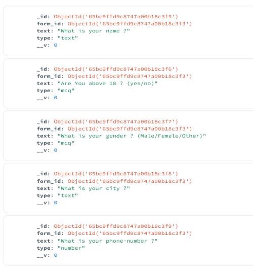

3. **Response Table** :

4. **Answer Table** :

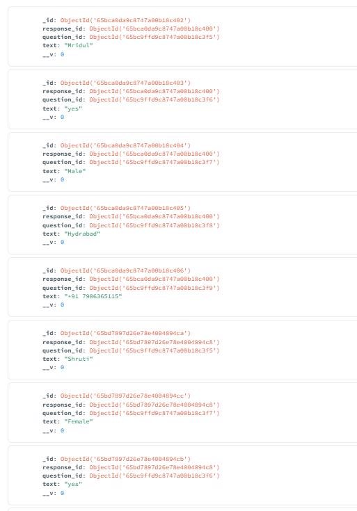
